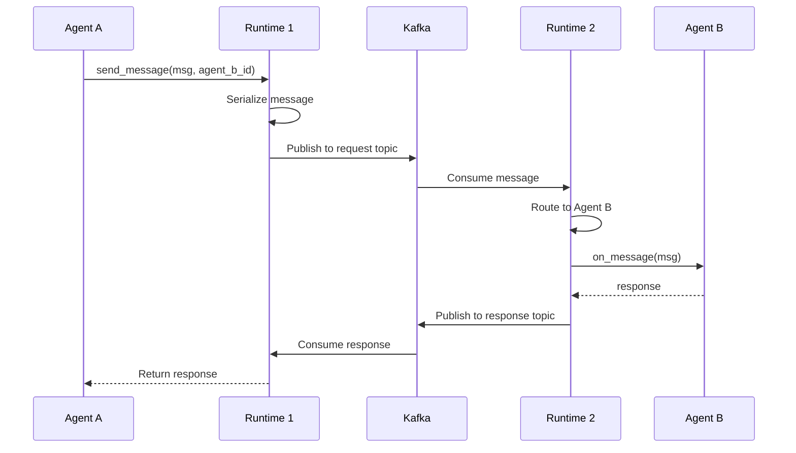
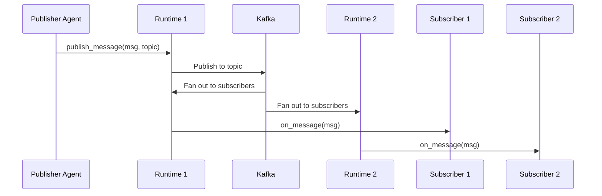

# AutoGen Kafka Extension - API Documentation

This document provides comprehensive API documentation for the AutoGen Kafka Extension, including architecture overview, component interactions, and detailed API reference.

## 🏗️ Architecture Overview

The AutoGen Kafka Extension provides a distributed agent runtime built on Apache Kafka. The system enables multi-agent communication across processes and machines through event-driven messaging.

### Core Components

```
┌─────────────────────────────────────────────────────────────────┐
│                    AutoGen Kafka Extension                      │
├─────────────────────────────────────────────────────────────────┤
│  ┌─────────────────┐  ┌─────────────────┐  ┌─────────────────┐ │
│  │   Agent Layer   │  │  Runtime Layer  │  │  Config Layer   │ │
│  │                 │  │                 │  │                 │ │
│  │ • Streaming     │  │ • Worker        │  │ • Validation    │ │
│  │   Agent         │  │   Runtime       │  │ • Auto-config   │ │
│  │ • Event         │  │ • Messaging     │  │ • Service       │ │
│  │   Handling      │  │   Client        │  │   Configs       │ │
│  └─────────────────┘  └─────────────────┘  └─────────────────┘ │
├─────────────────────────────────────────────────────────────────┤
│  ┌─────────────────┐  ┌─────────────────┐  ┌─────────────────┐ │
│  │  Services Layer │  │   Events Layer  │  │  Memory Layer   │ │
│  │                 │  │                 │  │                 │ │
│  │ • Agent Manager │  │ • CloudEvents   │  │ • Kafka Memory  │ │
│  │ • Subscription  │  │ • Serialization │  │ • State Sync    │ │
│  │ • Message Proc. │  │ • Event Types   │  │ • Persistence   │ │
│  │ • Agent Registry│  └─────────────────┘  └─────────────────┘ │
│  └─────────────────┘                                           │
├─────────────────────────────────────────────────────────────────┤
│  ┌─────────────────┐  ┌─────────────────┐  ┌─────────────────┐ │
│  │ Streaming Layer │  │   Admin Layer   │  │  Monitoring     │ │
│  │                 │  │                 │  │                 │ │
│  │ • Streaming     │  │ • Topic Admin   │  │ • OpenTelemetry │ │
│  │   Service       │  │ • Schema Reg.   │  │ • Metrics       │ │
│  │ • Worker Base   │  │ • Background    │  │ • Tracing       │ │
│  │ • Task Manager  │  │   Tasks         │  │ • Health        │ │
│  └─────────────────┘  └─────────────────┘  └─────────────────┘ │
└─────────────────────────────────────────────────────────────────┘
                                │
                    ┌───────────▼──────────┐
                    │   Apache Kafka       │
                    │                      │
                    │ • Topics             │
                    │ • Partitions         │
                    │ • Consumer Groups    │
                    │ • Schema Registry    │
                    └──────────────────────┘
```

## 📋 Component Reference

### Agent Layer

#### `KafkaStreamingAgent`
Bridge component that connects AutoGen agents to Kafka topics, enabling hybrid agent-to-topic communication.

**Key Methods:**
- `on_message_impl()` - Handles AutoGen messages, serializes and sends to Kafka
- `_handle_event()` - Processes Kafka messages and resolves pending requests
- `save_state()` / `load_state()` - Agent state persistence
- `close()` - Graceful resource cleanup

**Usage Pattern:**
```python
agent = KafkaStreamingAgent(config, "Bridge to external service")
await agent.start()
# Agent processes messages between AutoGen and Kafka
```

### Runtime Layer

#### `KafkaWorkerAgentRuntime`
Main distributed runtime that coordinates agents across multiple processes/machines.

**Key Responsibilities:**
- Agent lifecycle management
- Message routing and delivery
- Service orchestration
- State synchronization

**Key Methods:**
- `register_factory()` - Register agent factory for type
- `send_message()` - Send message to specific agent
- `publish_message()` - Publish to topic
- `start()` / `stop()` - Runtime lifecycle

#### `MessagingClient`
High-level messaging abstraction for agent communication.

**Features:**
- Request/response patterns
- Topic publish/subscribe
- Message serialization
- Error handling

### Services Layer

#### `AgentManager`
Manages agent instances and their lifecycle within a runtime.

**Key Methods:**
- `register_factory()` - Register agent factory
- `register_instance()` - Register pre-created agent
- `get_agent()` - Retrieve/instantiate agent by ID
- `try_get_underlying_agent_instance()` - Type-safe agent retrieval

#### `SubscriptionService`
Manages topic subscriptions and message routing.

**Functions:**
- Subscribe agents to topics
- Route messages to subscribers
- Manage subscription lifecycle
- Handle subscription conflicts

#### `MessageProcessor`
Core message processing engine.

**Operations:**
- `process_event()` - Process CloudEvent messages
- `process_request()` - Handle RPC requests
- Message deserialization
- Response correlation

#### `AgentRegistry`
Distributed agent discovery and registration.

**Features:**
- Agent type registration
- Cross-runtime discovery
- Health monitoring
- Registration cleanup

### Events Layer

#### CloudEvents Integration
Built on CloudEvents specification for interoperability.

**Event Types:**
- `RequestEvent` - Agent-to-agent RPC requests
- `ResponseEvent` - RPC responses
- `RegistrationEvent` - Agent registration
- `SubscriptionEvent` - Topic subscriptions
- `MemoryEvent` - Memory state changes

#### Serialization System
Pluggable serialization with Schema Registry integration.

**Components:**
- `EventSerializer` - Event → bytes
- `EventDeserializer` - bytes → Event
- Schema validation
- Type safety

### Configuration Layer

#### Configuration Hierarchy
```
BaseConfig (abstract)
├── ServiceBaseConfig
│   ├── KafkaAgentConfig
│   └── KafkaWorkerConfig
├── KafkaConfig
├── MemoryConfig
└── StreamingConfig
```

**Features:**
- Validation pipeline
- Auto-validation decorators
- Environment variable support
- Nested configuration composition

## 🔄 Message Flow Diagrams

### Agent-to-Agent Communication


### Topic Publish/Subscribe


## 🔧 Configuration Examples

### Basic Worker Configuration
```python
from autogen_kafka_extension import KafkaWorkerConfig, KafkaConfig

kafka_config = KafkaConfig(
    bootstrap_servers=["localhost:9092"],
    security_protocol="PLAINTEXT",
    schema_registry={"url": "http://localhost:8081"}
)

worker_config = KafkaWorkerConfig(
    kafka_config=kafka_config,
    name="my-worker",
    group_id="agent-group",
    client_id="worker-1",
    request_topic="agent.requests",
    response_topic="agent.responses"
)
```

### Agent Configuration
```python
from autogen_kafka_extension import KafkaAgentConfig

agent_config = KafkaAgentConfig(
    kafka_config=kafka_config,
    request_topic="external.requests",
    response_topic="external.responses"
)
```

## 🔍 Error Handling

### Exception Hierarchy
```
AutogenKafkaError (proposed)
├── ConfigValidationError
├── KafkaMemoryError
├── SerializationError (proposed)
├── ConnectionError (proposed)
└── AgentError (proposed)
```

### Error Recovery Patterns
- **Connection failures**: Automatic retry with exponential backoff
- **Serialization errors**: Fallback to string representation with logging
- **Agent errors**: Isolation - one agent failure doesn't affect others
- **Configuration errors**: Fail-fast with detailed validation messages

## 📊 Monitoring & Observability

### Metrics (Prometheus)
- Message throughput by topic
- Agent processing latency
- Error rates by component
- Connection pool statistics

### Tracing (OpenTelemetry)
- End-to-end request tracing
- Agent processing spans
- Kafka operations
- Cross-service correlation

### Health Checks
- Kafka connectivity
- Schema Registry availability
- Agent responsiveness
- Resource utilization

## 🧪 Testing Patterns

### Unit Testing
```python
@pytest.fixture
def mock_config():
    return Mock(spec=KafkaWorkerConfig)

async def test_agent_message_handling(mock_config):
    agent = KafkaStreamingAgent(mock_config, "test")
    # Test implementation
```

### Integration Testing
```python
@pytest.mark.integration
async def test_end_to_end_communication():
    # Set up real Kafka instance
    # Test actual message flow
```

## 📚 Usage Patterns

### Pattern 1: Distributed Agent System
Multiple runtimes with different agent types collaborating.

### Pattern 2: Kafka Bridge
AutoGen agents communicating with external Kafka-based services.

### Pattern 3: Hybrid Architecture
Mix of local and distributed agents with selective Kafka integration.

## 🔄 Lifecycle Management

### Startup Sequence
1. Configuration validation
2. Kafka connection establishment
3. Topic creation/verification
4. Service initialization
5. Agent registration
6. Subscription setup
7. Message processing start

### Shutdown Sequence
1. Stop accepting new messages
2. Complete pending requests
3. Clean up subscriptions
4. Close agent instances
5. Stop services
6. Close Kafka connections
7. Resource cleanup

---

For detailed API reference, see individual component documentation in the respective module directories. 